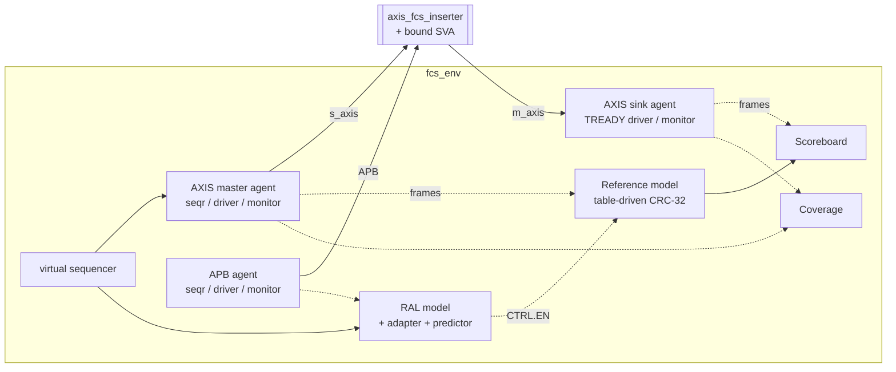

# axis-fcs-uvm — UVM Verification of an AXI-Stream Ethernet FCS Inserter

A complete, from-scratch **SystemVerilog/UVM 1.2** verification environment for a small networking
block: an 8-bit **AXI-Stream Ethernet FCS (CRC-32) inserter** with an **APB register block**.
It shows a realistic block-level DV flow: verification plan, constrained-random stimulus,
reference model + scoreboard, RAL, functional coverage, SVA, multi-seed regressions, bug injection
to prove the testbench catches real defects, and coverage-hole analysis.

▶ **Run it in the browser:** https://edaplayground.com/x/YrmF

## Architecture



## DUT summary
| Address | Register | Access | Description |
|---------|----------|--------|-------------|
| 0x00 | CTRL | RW | bit0 `EN` (reset 1): append FCS; 0 = pass-through |
| 0x04 | FRAME_CNT | RO | input frames accepted |
| 0x08 | BYTE_CNT | RO | input bytes accepted |
| 0x0C | SCRATCH | RW | scratch register |
| 0x10 | VERSION | RO | 0x0001_0000 |
| other | — | — | PSLVERR = 1 |

## Verification features
- **Constrained-random stimulus**: weighted frame length 1–256, per-byte idle gaps,
  all-zero / all-one data patterns, CTRL.EN toggled between traffic batches.
- **Backpressure**: sink agent randomizes TREADY (`ready_pct` knob, changeable at runtime).
- **Reference model + scoreboard**: table-driven CRC-32 (independent from the bitwise RTL),
  in-order comparison through TLM FIFOs, drain check at end of test.
- **RAL**: register model, `reg2apb_adapter`, explicit `uvm_reg_predictor`; built-in
  `uvm_reg_hw_reset_seq` and `uvm_reg_bit_bash_seq`; end-of-test counter check vs. the model.
- **Functional coverage**: length × EN, gaps × EN, pattern × EN, output stalls × EN, with a
  per-coverpoint breakdown printed in the log.
- **SVA**: AXI-Stream protocol checker bound to both ports and white-box FSM assertions.
- **Bug injection**: three RTL bugs selectable with defines to measure testbench effectiveness.
- **Automation**: Makefile for VCS/Xcelium, Python multi-seed regression with CSV summary and
  coverage merge, Python golden-model cross-check of the CRC algorithms.

## Repository layout
```
rtl/                    DUT
tb/if/                  AXI-Stream and APB interfaces (clocking blocks)
tb/sva/                 protocol + DUT assertions and bind file
tb/agents/{axis,apb}/   UVM agents and sequences
tb/ral/                 register model and adapter
tb/env/                 reference model, scoreboard, coverage, env, virtual sequencer
tb/seqs/  tb/tests/     virtual sequences and tests
tb/top/                 tb_top
tb/standalone/          non-UVM RTL sanity test (Verilator)
sim/                    files.f, Makefile
scripts/                regress.py, crc32_golden.py, eda_playground_bundle.py
docs/                   verification_plan.md
```

## Running
```bash
cd sim
make vcs  TEST=fcs_full_test SEED=7            # Synopsys VCS (+ FSDB for Verdi)
make xrun TEST=fcs_backpressure_test SEED=3    # Cadence Xcelium
make verdi                                     # debug last VCS run in Verdi
cd ..
python3 scripts/regress.py --sim vcs --seeds 10              # full regression + URG coverage
python3 scripts/regress.py --sim vcs --bug BUG_NO_FINAL_XOR  # negative test (expects failure)
python3 scripts/crc32_golden.py                              # CRC golden-model check
make -C sim verilator_sanity                                 # open-source RTL sanity test (no UVM)
```

**EDA Playground**: `python3 scripts/eda_playground_bundle.py`, paste `eda_playground/design.sv` and
`testbench.sv`, select *UVM 1.2* + *Synopsys VCS*, compile options
`-timescale=1ns/1ns +vcs+flush+all +warn=all -sverilog` (add `+define+VCD` for EPWave),
run options `+UVM_TESTNAME=fcs_full_test`.

## Tests
| Test | Description |
|------|-------------|
| `fcs_smoke_test` | 5 short frames, EN=1, no backpressure |
| `fcs_reg_test` | reset values, bit-bash, PSLVERR on unmapped addresses |
| `fcs_corner_test` | lengths 1/2/255/256, all-0x00/0xFF, short frames with idles, both EN modes |
| `fcs_random_test` | 8 batches × 25 random frames, EN toggled, 80% TREADY |
| `fcs_backpressure_test` | random test with 30% TREADY |
| `fcs_full_test` | coverage closure: corner frames + random traffic with TREADY swept 100/80/30% |

## Results (Synopsys VCS on EDA Playground)
| Test | Seeds | Frames/run | Result | Functional coverage (in / out) |
|------|-------|-----------|--------|-------------------------------|
| fcs_smoke_test | 1 | 5 | PASS | — |
| fcs_reg_test | 1 | — | PASS | n/a (register test) |
| fcs_corner_test | 1 | 24 | PASS | 98.81% / 94.44% |
| fcs_random_test | 1 | 200 | PASS | 96.43% / 94.44% |
| fcs_backpressure_test | 1, 7, 42 | 200 | PASS | per-test bins limited by design (30% TREADY) |
| **fcs_full_test** | **1, 7, 42** | 324 | **PASS** | **100% / 100%** (all coverpoints and crosses) |

**Coverage closure history** (details in [docs/verification_plan.md](docs/verification_plan.md#5-coverage-analysis-log)):

| Step | fcs_random_test input coverage | Action |
|------|-------------------------------|--------|
| Initial regression | 76.19–88.10% | Holes in len × EN and gaps bins |
| Root cause | — | `dist :=` gave each value of a range the full weight → P(len=1)=P(len=256)≈0.1% |
| Fix `:=` → `:/` | 96.43% (seed 1) | Remaining holes are single-run probabilistic (pattern × EN, stalls × EN) |
| Closure test | **100% / 100%** in `fcs_full_test` on 3 seeds | Corner frames + TREADY sweep 100/80/30% |

| Injected bug | Detected by |
|--------------|-------------|
| `BUG_NO_FINAL_XOR` | Scoreboard (`SB_DATA`) ✅ |
| `BUG_IGNORE_BACKPRESSURE` | SVA `a_payload_stable` ✅ |
| `BUG_CNT_ON_VALID` | RAL counter check (`CSR`) ✅ |

## Author
Josafat Trejos Sequeira — [LinkedIn](https://linkedin.com/in/josafat-trejos-sequeira)
